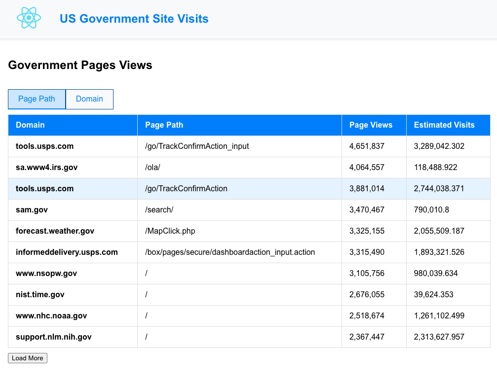
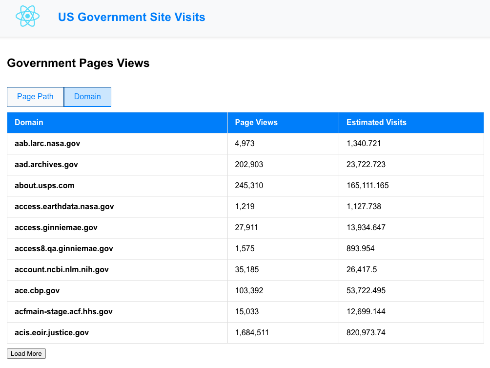

# Web Traffic Statistics Application

## Overview

Create a web application to show simple web traffic statistics for government sites and pages. The data being displayed is about the number of pageviews and visits to different domains and pages.

## Technologies

- **Front end:** Angular
- **Back end:** ASP.NET Core 8

## Application Description

The application will have one page, with:

- **Toggle:** Which view of the data to show.
- **Table:** The web traffic data.

### View 1: 'Page Path' View

- **Domain:** Domain of the website
- **Page Path:** URL of the page being viewed on that website
- **Pageviews:** Number of pageviews this page got in the past 90 days
- **Estimated Visits:** Inferred based on another database table (see more below)

### View 2: 'Domain' View

- **Domain:** Domain of the website
- **Pageviews:** Number of pageviews this domain got, across all its page paths
- **Estimated Visits:** Inferred based on another database table (see more below)

## Data Notes

The **Estimated Visits** column is inferred by matching the domain and hostname, and then using the pageviews from `path_pageviews` and the ratio of visits per pageview in `host_pageviews`. For example, if we have 100 pageviews for a given page path, and its corresponding domain in the `host_pageviews` table has 500 pageviews and 250 visits, the estimated visits for that page path would be 50.

## Mockups

Note that your views do not have to look exactly like these. It should have "decent" styling but does not need to have a lot of polish.

### Page Path View

### Domain View

